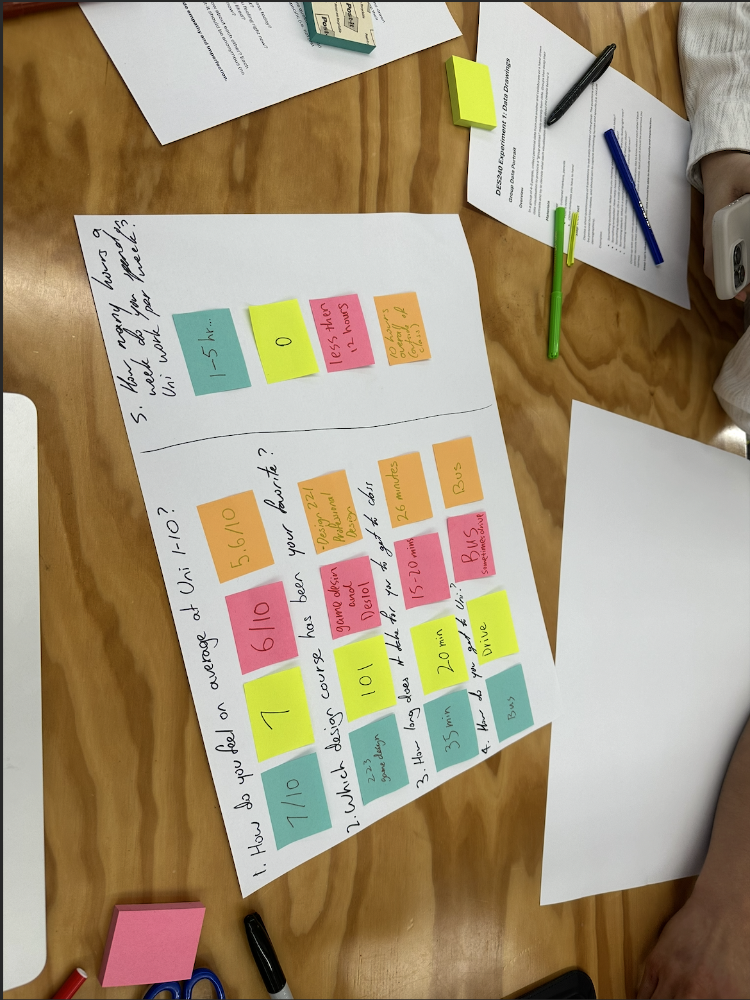
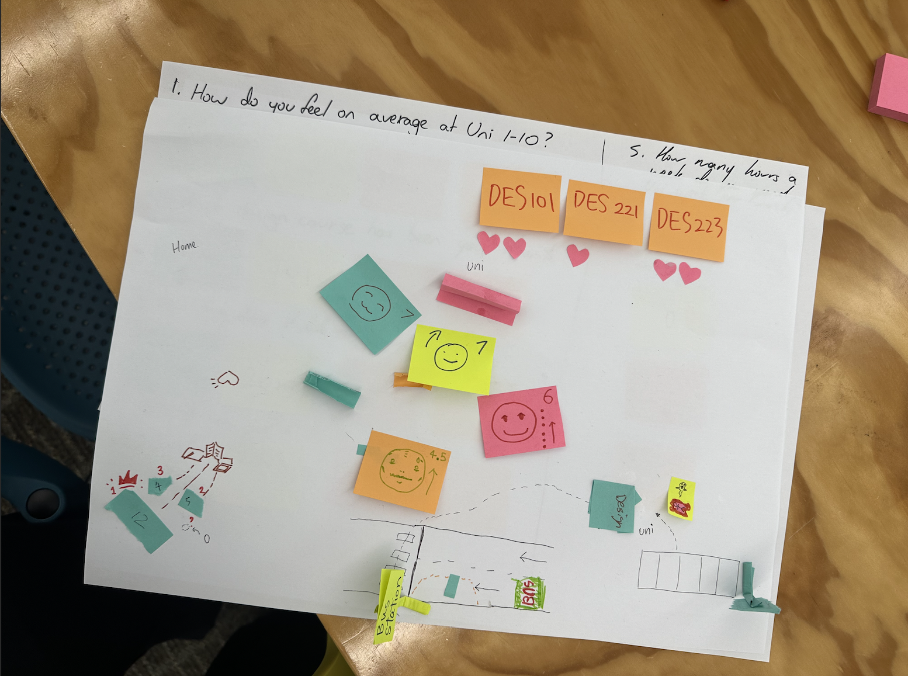

# Week 01

[← Back to Home](../index.md)

## Experiment 1: Data Drawings 

In a group, we created a hand-drawn data portrait by asking each other a set of personal but low-stakes questions. These included how we felt at uni, how long we study, how we get to uni, and other everyday behaviours. Each person recorded their answers anonymously on post-it notes.

*The text inside the square brackets is alt text (a description for accessibility), not a visible caption. To add a caption, place a line of italic text below the image.*

As a group, we translated this data into a visual system using drawings, symbols, colour, and spatial arrangement. Instead of using traditional graphs, we created a more expressive and playful composition. We then swapped with another group and attempted to decode their data drawing by interpreting their visual language.

From the other group’s work, we identified patterns such as wake-up times, weight, number of siblings (represented as a tree), and transport methods like walking, bus, or driving. This showed how different groups approached encoding data in unique ways.

## Independent Study: Data Portrait

What I tracked:
I tracked my phone usage over 5 days, focusing on when I used my phone, what I used it for (practical, entertainment, communication, passive), and the context of use.

Why:
I chose this because phone usage is something I do frequently but don’t usually reflect on. I wanted to understand patterns in how and why I use my phone throughout the day.

## Process:
I recorded data manually over several days, noting time, type of use, and a short description of what I was doing. I categorised usage into:
Practical (e.g. alarms, checking times)

Entertainment (e.g. YouTube)

Communication (e.g. messaging, calls)

Passive (e.g. scrolling)

Day 1

8:00 — practical — active

8:42 — entertainment — passive

10:12 — practical — active

12:03 — passive — passive

Day 2

8:05 — practical — active

8:47 — entertainment — passive

9:25 — practical — active

11:52 — passive — passive

Day 3

8:02 — practical — active

8:39 — entertainment — passive

10:33 — communication — active

13:47 — passive — passive

Day 4

8:10 — practical — active

8:55 — entertainment — passive

12:10 — communication — active

22:40 — passive — passive

Day 5

8:00 — practical — active

8:43 — entertainment — passive

15:05 — communication — active

22:30 — passive — passive

Reflection:
This experiment made me more aware of how frequently I use my phone in small, habitual ways, especially passive scrolling. Recording the data manually made me more conscious of my behaviour, which I normally wouldn’t notice.
The process of designing a visual language was more challenging than expected. Instead of using standard graphs, I had to think about how colour, position, and timing could represent meaning. This relates to the idea of data humanism, where data is more personal, subjective, and expressive rather than purely numerical.
Compared to traditional data visualisation, this approach felt more reflective and interpretive. However, some information is simplified or lost, such as exact durations or overlaps in usage.
If I continued this, I would refine the categories further and possibly include duration more clearly, or explore a more physical/hand-drawn version instead of digital.

## Reflection:

This experiment made me more aware of how frequently I use my phone in small, habitual ways, especially passive scrolling. Recording the data manually made me more conscious of my behaviour, which I normally wouldn’t notice.
The process of designing a visual language was more challenging than expected. Instead of using standard graphs, I had to think about how colour, position, and timing could represent meaning. This relates to the idea of data humanism, where data is more personal, subjective, and expressive rather than purely numerical.
Compared to traditional data visualisation, this approach felt more reflective and interpretive. However, some information is simplified or lost, such as exact durations or overlaps in usage.
If I continued this, I would refine the categories further and possibly include duration more clearly, or explore a more physical/hand-drawn version instead of digital.

## AI Usage Statement
I made rough notes in my personal notes while documenting everything in the making diary's but had ChatGPT reword it into something more organized and readable.

