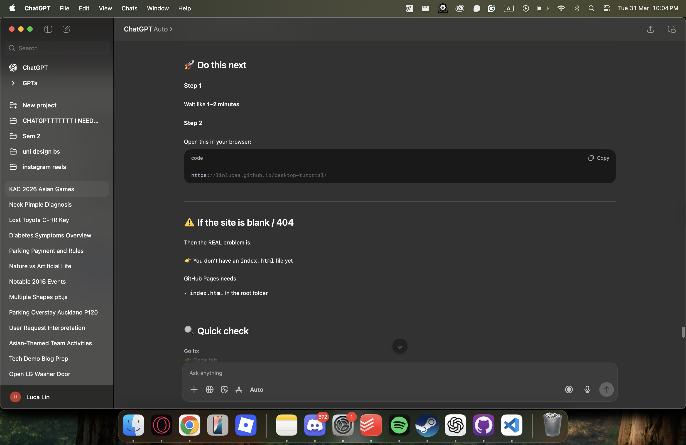
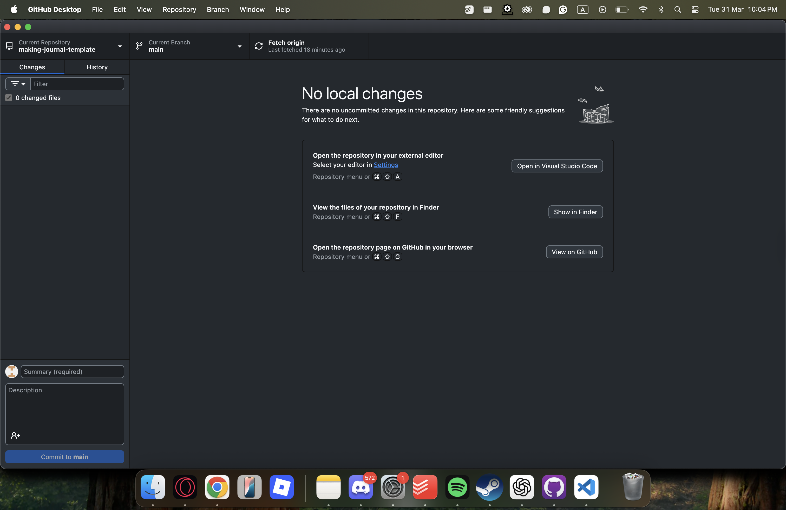
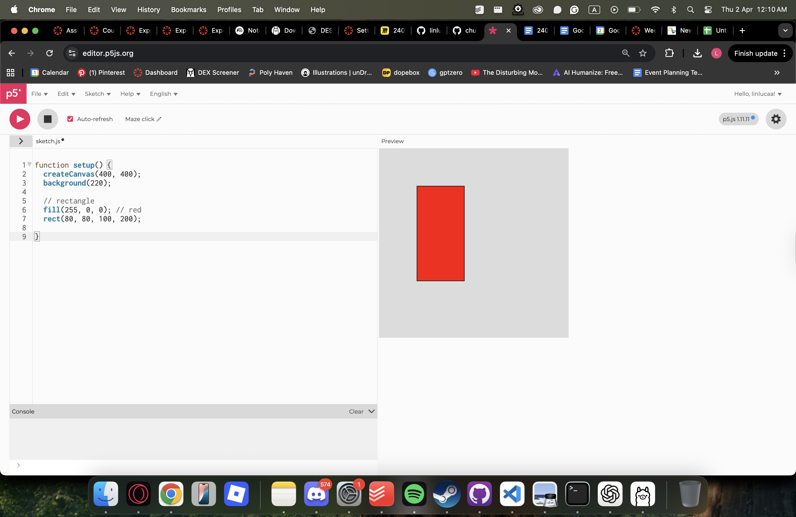
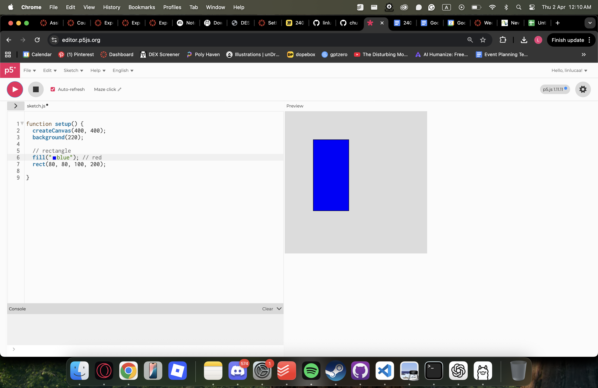
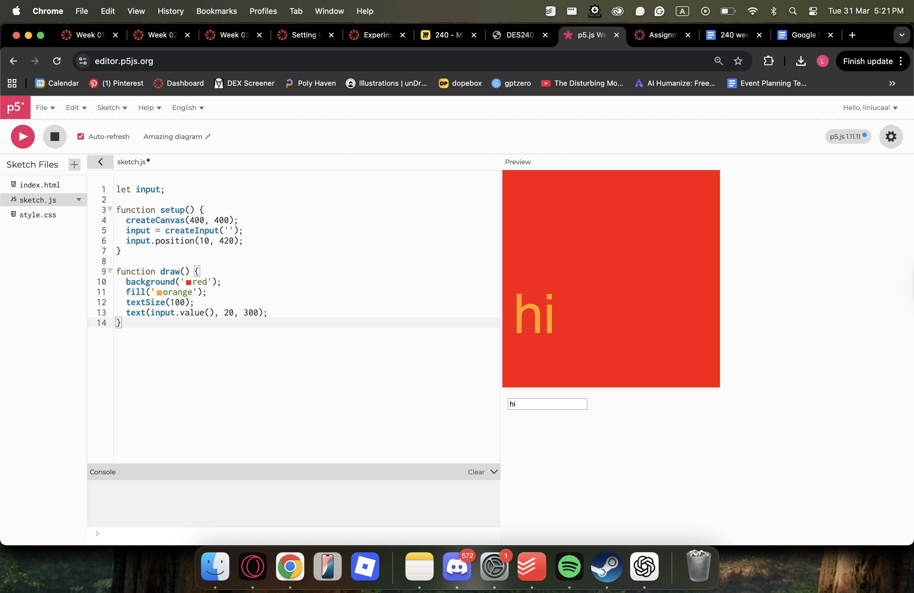
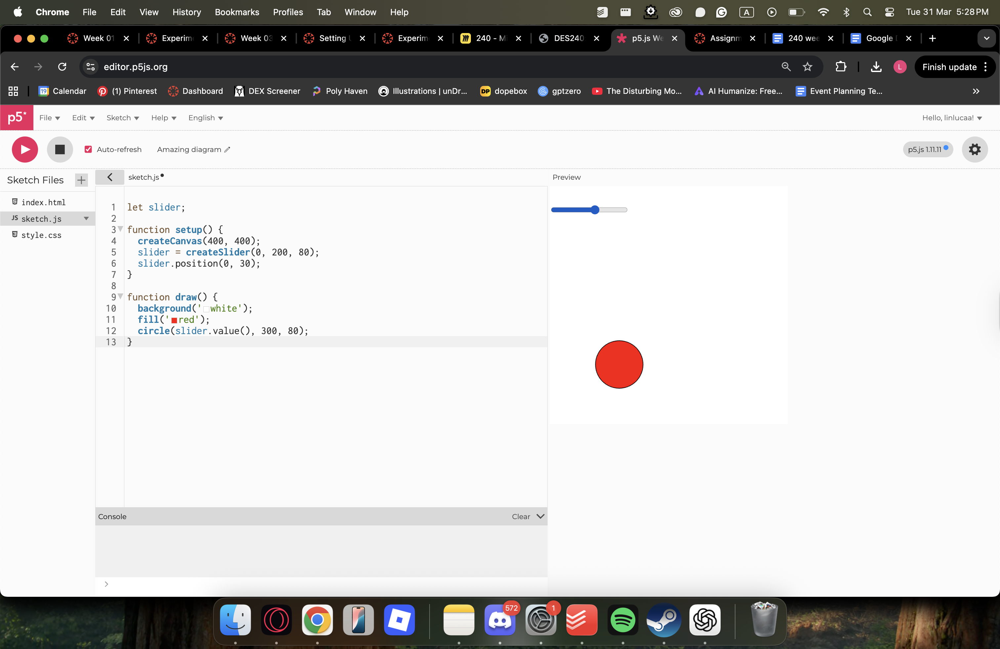
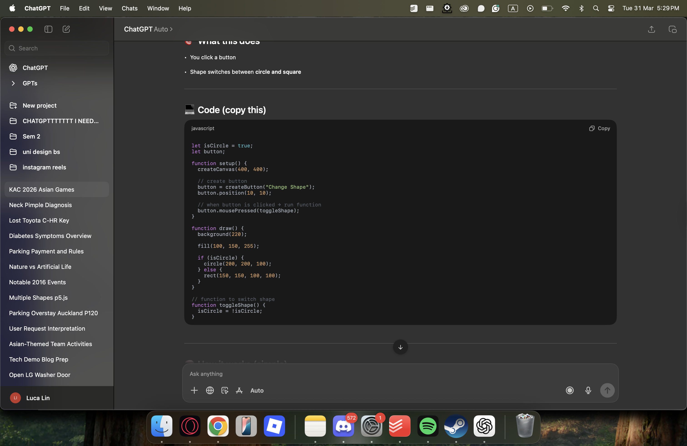
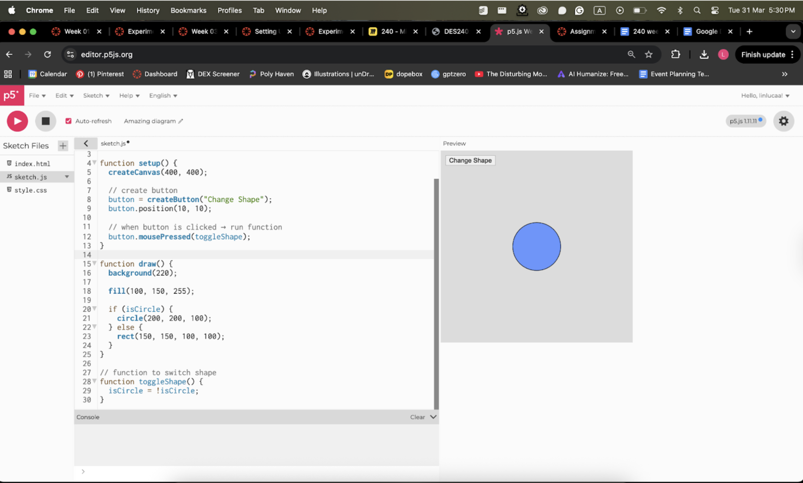

# Week 02

[← Back to Home](../index.md)

## Experiment 2: Interactivity

### Getting Started
This week I worked with p5.js for the first time and also continued setting up my workflow. I initially struggled with GitHub setup, as the tutorial didn’t cover everything, so I relied on ChatGPT to help troubleshoot. Even then, the process was confusing and stressful, which made me realise how many small technical steps are involved before even starting creative work  .

## Images & Media

*Use the format below to embed images from your assets folder:*

## Activity 1: Drawing with Code

I started by experimenting with simple shapes in p5.js. Using functions like rect() and ellipse(), I created basic compositions and explored how colour, size, and position worked.
I kept things simple at first, which helped me understand what each line of code was doing. By changing values like size and position, I could immediately see how the output changed. This made the process feel more like experimentation rather than just coding  .
One key thing I learned was how order affects drawing. Shapes drawn later appear on top, which made me think of code as layering rather than just instructions.

## Activity 2: Interactive Sketch
I then moved on to adding interactivity using DOM elements like sliders and text inputs.
I created:
a text input that displays words on the canvas

a slider that changes the size or position of a shape

This was where things started to feel more interesting. Instead of just drawing, the sketch became something that responds to input. It felt like a shift from static images to something more dynamic and user-driven.
However, it also became more complex, and I had to think more carefully about how different parts of the code connect.

## Activity 3: Interactive Sketch

For the final activity, I used ChatGPT to generate a more complex interactive sketch.
The idea I worked on was: 
tracking when and why I use my phone over a few days
The AI generated a working sketch, and I copied it into p5.js. It worked, but I didn’t fully understand it at first, so I started breaking it down line by line.
This process was useful because:
it showed me how quickly AI can produce working code but also how easy it is to rely on code without understanding it

## Reflection
This week felt like a balance between:
- copying and experimenting 
- understanding and not understanding

p5.js was interesting because I could immediately see the result of small changes, which made learning more engaging. Starting simple was important, as it helped me build confidence before adding more complexity.
Using AI was helpful for generating ideas and code quickly, but it also highlighted a limitation. The code worked, but I still need to actively break it down and understand it, otherwise I’m just using it passively.
At the moment, I’m not fully confident using p5.js independently, but I can see how practice and experimentation will improve this over time.

## Key Takeaways
- Code works like a visual system where order and layering matter

- Interactivity makes sketches more engaging and meaningful

- AI can speed up development, but understanding still requires effort

- Starting simple and experimenting is the most effective way to learn

## AI Usage Statement

- I used ChatGPT to help me set up GitHub beacuse the slides' instructions were not clear at all and missed out on a lot of steps
- I used ChatGPT to help me VibeCode on p5.js as well as to help me understand what the slides were teaching me
- Like the previous week, I used ChatGPT to organize my notes into something more readable