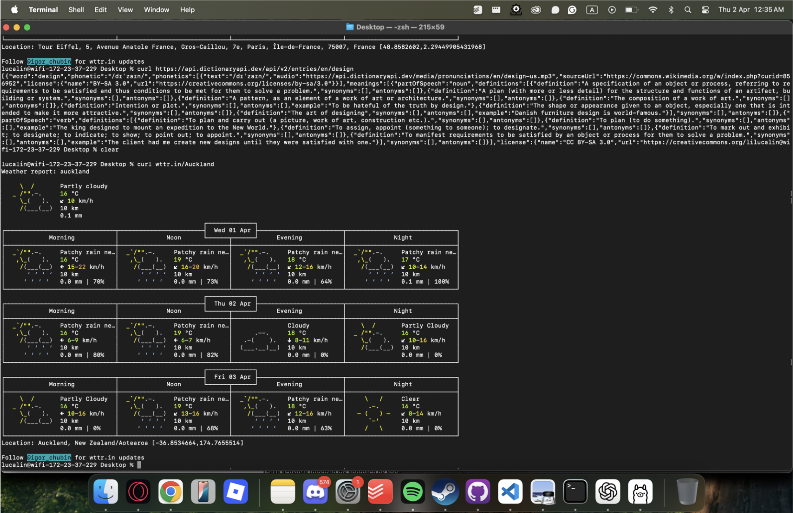
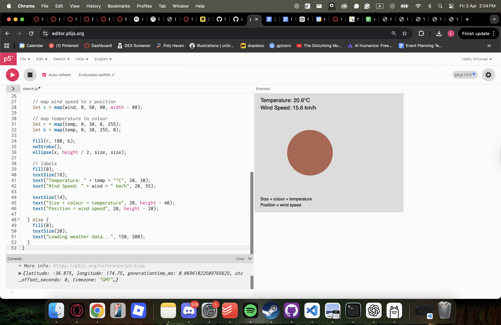
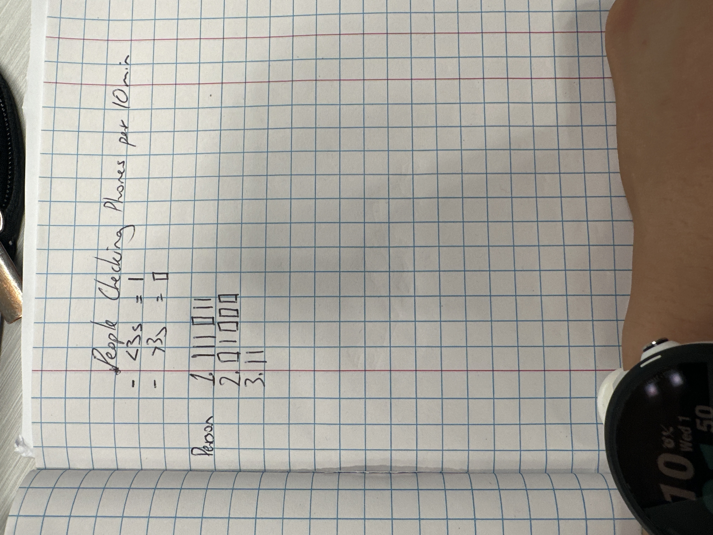
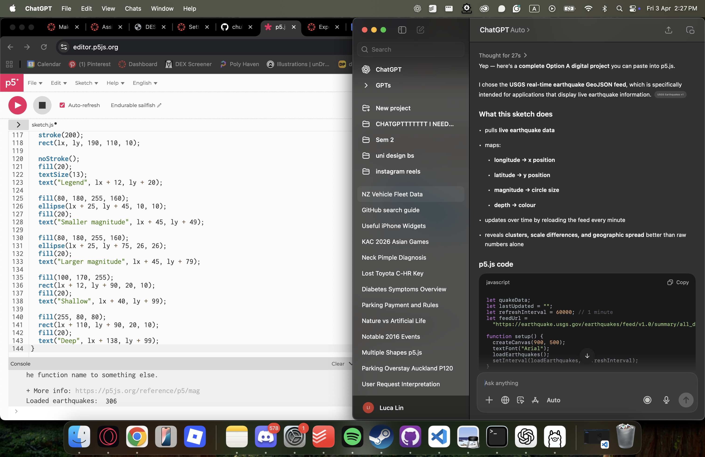
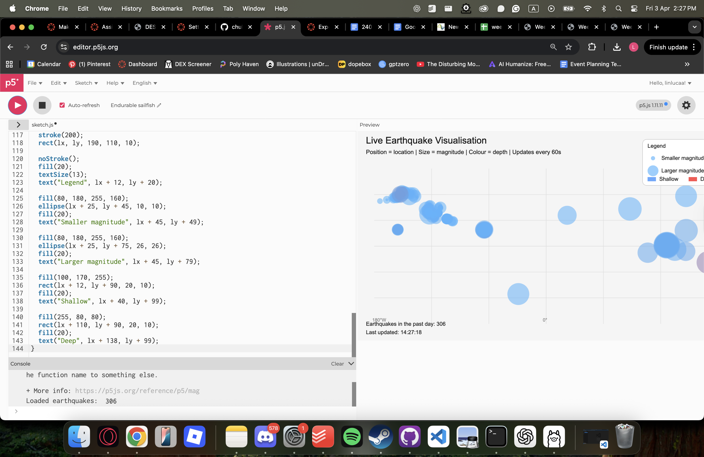

# Week 03

[← Back to Home](../index.md)

## Experiment 3: Live Data

### Activity 1: Exploring Live Data with cURL

In this activity, I used cURL alongside API documentation (wttr.in and the Free Dictionary API) to request live data such as weather, language, and word definitions. By modifying URLs, I was able to retrieve different types of information in real time.
This introduced the idea that data is not fixed or static, but can be accessed dynamically through structured queries. It shifted my understanding of data from something that is collected and stored, to something that can be continuously requested and updated. The consistent structure of API responses also made it clear how systems can reliably deliver changing data.

### Activity 2: Weather Visualisation in p5.js

I used a p5.js sketch connected to the Open-Meteo API to visualise live weather data. The sketch retrieved values such as temperature and wind speed, which I then mapped to visual properties like size, position, and colour.
Through experimentation, I realised that the same data can be represented in many different ways depending on how it is mapped. For example, temperature could control size, colour, or position, each producing a different interpretation of the same information. This showed that visualisation is not neutral, and that design decisions directly shape how data is understood.
The sketch also introduced the idea of live updating systems, where the visual output changes over time as new data is received. This made the work feel dynamic rather than static, and highlighted the relationship between the rhythm of the data and the rhythm of the visual output.

### Activity 3: Designing a Data Protocol

In pairs, we designed and exchanged data protocols—sets of rules for observing and translating live data into visual marks. This activity acted as an analogue equivalent of an API, where clear instructions determine how data is collected and represented.
#### Protocol
- Source: People checking their phones

- Frequency: Continuous observation over 10 minutes

- Mapping:

    - Short check (<3 seconds) = |

    - Longer use (>3 seconds) = █

    - Each person = one row

#### Process
I initially considered using dots and circles to represent phone usage, but found them unclear in distinguishing between short and long interactions. I switched to vertical lines and filled blocks, which created a clearer visual contrast and better communicated differences in duration and intensity.

Data was recorded live in a notebook as events occurred, requiring quick interpretation and decision-making in real time.

#### Outcome
The final visual revealed distinct behavioural patterns. Some individuals checked their phones frequently in short bursts, while others engaged in longer, less frequent interactions. These patterns appeared as clusters rather than evenly distributed marks, making temporal behaviour visible in a way that simple observation would not.

#### Reflection
Although the system was simple, it revealed how subjective even basic rules can be. The distinction between “short” and “long” use depended on estimation, meaning different people could interpret the same behaviour differently. When the protocol was followed by others, small ambiguities in the instructions led to variations in the output.
This showed that rule-based systems are not completely objective. The clarity of instructions directly affects how data is interpreted and represented, and even small gaps can produce different results.

# Independent Study: Live Data
#### Approach
I chose a digital approach, as it allowed me to work with live, continuously updating data from an external source. Using an API meant the data could change independently of my input, making the visualisation more dynamic and responsive over time. It also allowed me to experiment more directly with mapping data to visual properties using code.

#### Data Source
Live earthquake data from a public API (USGS), which provides real-time information such as location, magnitude, and depth of earthquakes around the world.

#### Protocol
Although this was a digital system, it still followed a clear rule-based structure similar to a data protocol:
- Source: Live earthquake data from API
- Frequency: Data refreshed at regular intervals (e.g. every minute)
- Mapping:
    - Longitude → x position
    - Latitude → y position
    - Magnitude → circle size
    - Depth → colour

#### Process
I built a p5.js sketch that fetched live data from the API and translated each data point into a visual element. Each earthquake became a circle on the screen, positioned according to its geographic location and styled based on its magnitude and depth.

Through testing, I adjusted how values were mapped to ensure they were visually readable. For example, I scaled magnitude values so that differences in size were noticeable, and adjusted colour ranges to better distinguish between shallow and deep earthquakes.

#### Outcome
The resulting visual made behavioural patterns visible. It showed clustering of activity, with certain individuals engaging in repeated short interactions while others used their phones less frequently but for longer periods.
This representation revealed temporal and behavioural differences that would be difficult to track without a structured system.

#### Reflection
This experiment showed that digital visualisations rely on similar principles to analogue systems, but allow for more dynamic and scalable representations.

The mapping between data and visual form was critical. Small changes in how values were mapped (such as scaling size or colour) significantly affected how readable and meaningful the visualisation was. This reinforced that visualisation is not neutral, and that design decisions shape interpretation.

Unlike the analogue approach, the digital system removed some subjectivity in data collection, but introduced new challenges in choosing appropriate mappings and scales. It highlighted that even when data is automatically collected, interpretation still plays a major role.

## Further Development
If I had more time, I would:
- refine the timing thresholds to reduce ambiguity

- experiment with more structured layouts or grids

- explore translating the protocol into a digital or interactive format

- compare multiple iterations of the same protocol to analyse variation

## Final Reflection
This experiment showed that both digital and analogue approaches rely on systems for translating live data into visual form. It highlighted the importance of design decisions, the role of interpretation, and the impact of ambiguity in rule-based systems.

The process made it clear that data is not neutral, and that the way it is collected, structured, and visualised directly influences what is seen and understood.

## AI Usage Statement
- I used ChatGPT to code most of the entries as well as helping me operate the terminal
- I also used ChatGPT to help me understand the assignment and what were the specific things I had to do