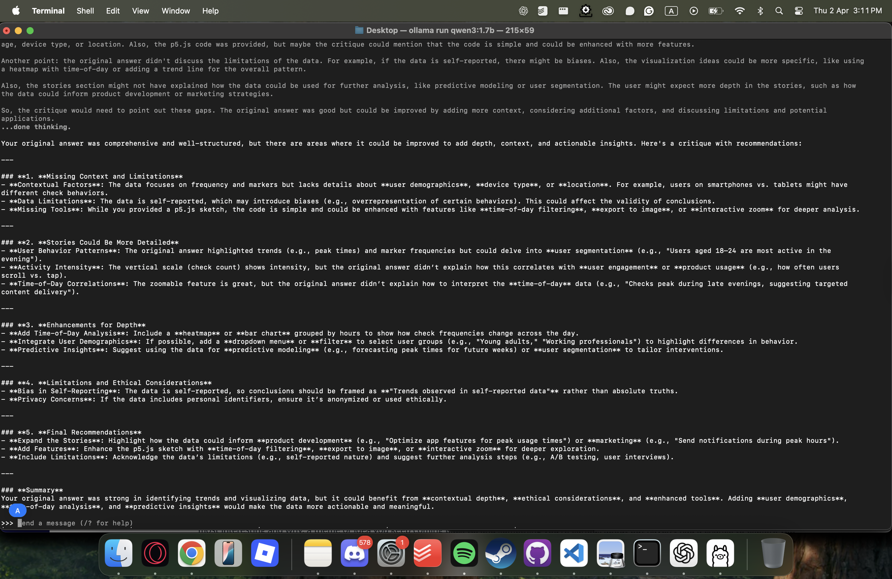
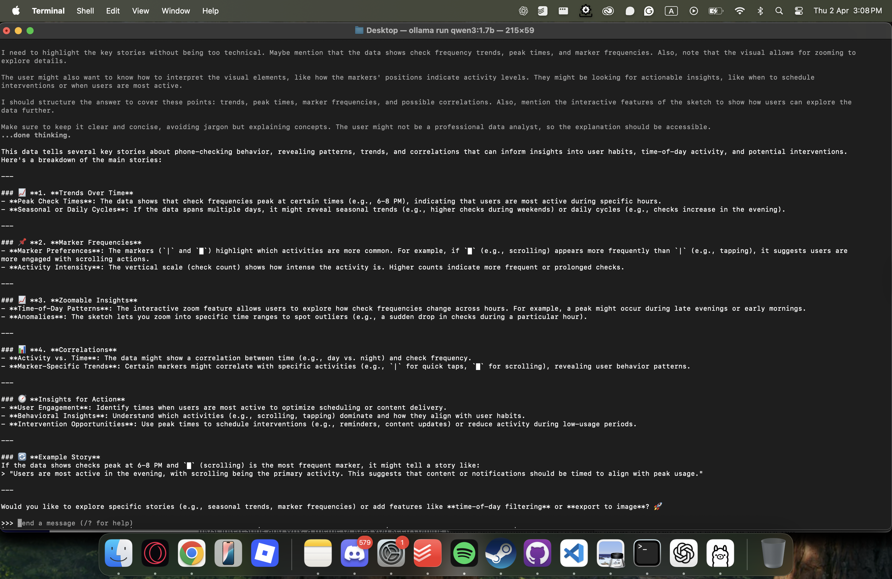
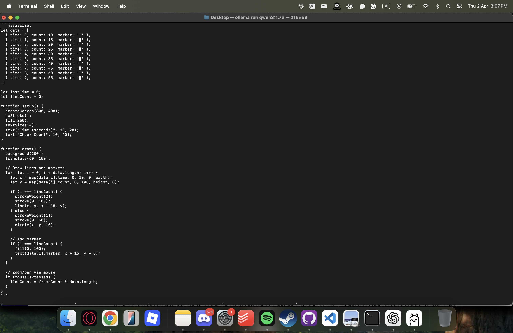
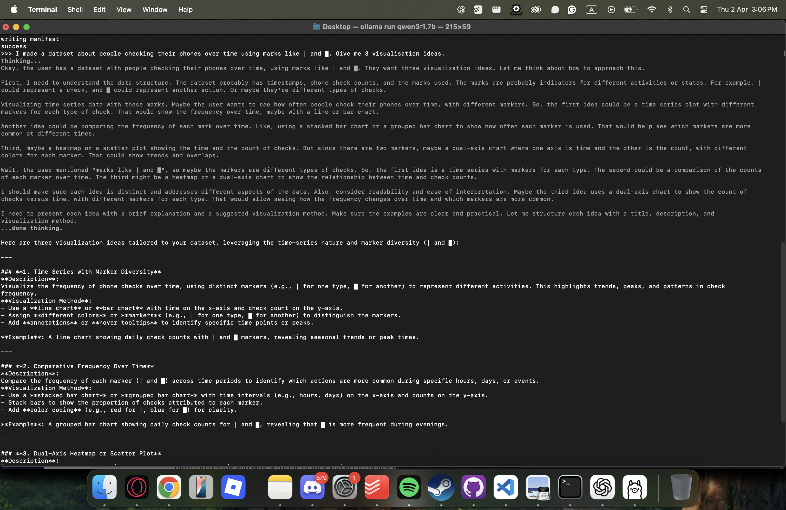
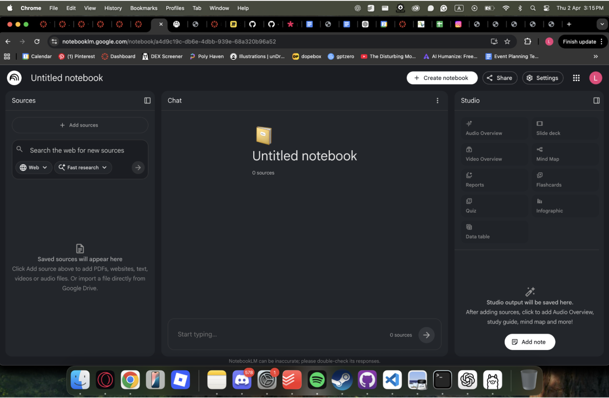
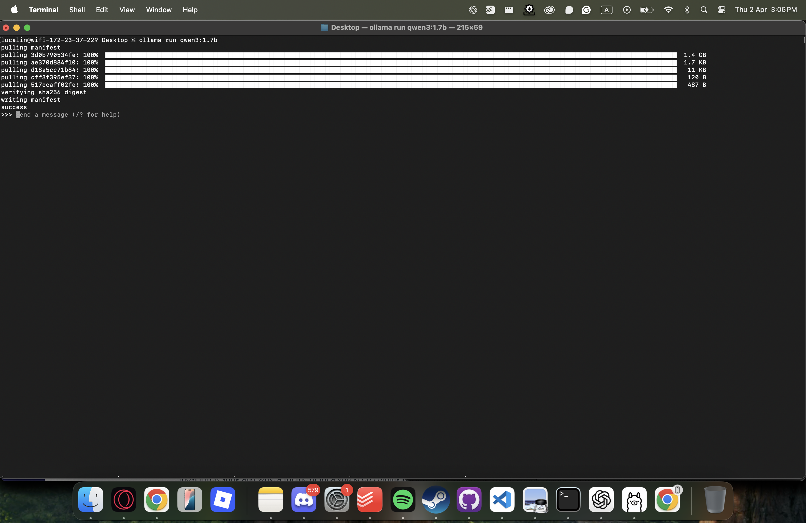
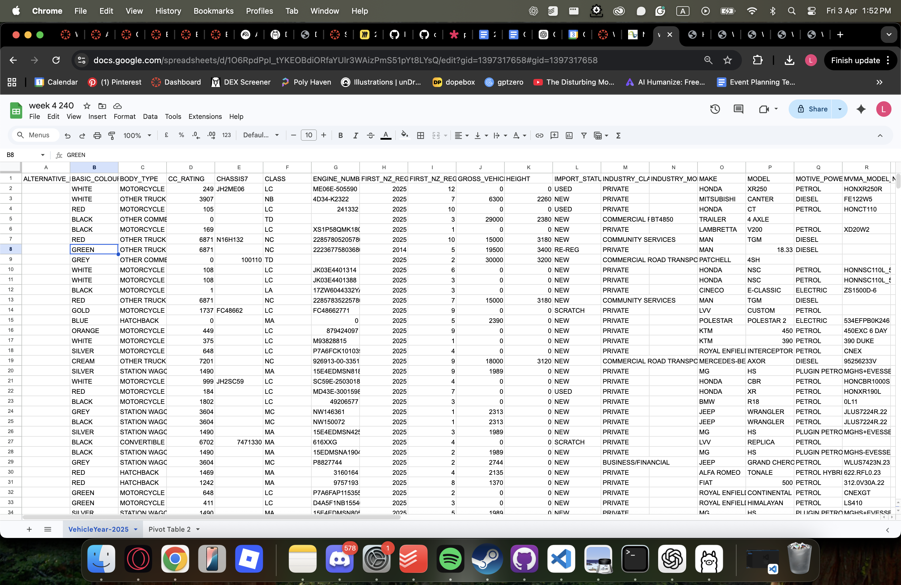
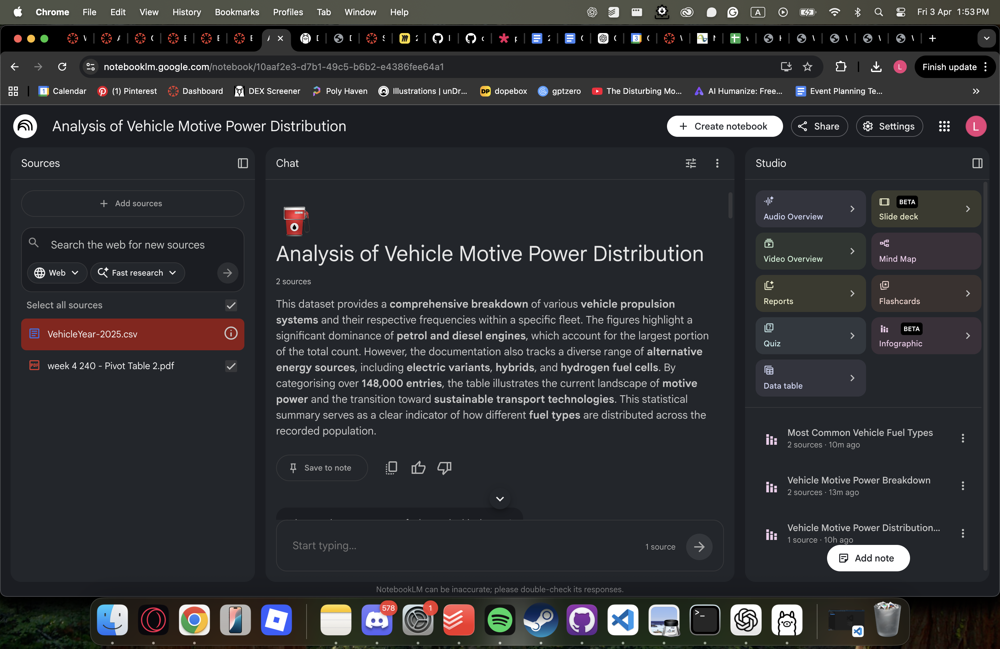
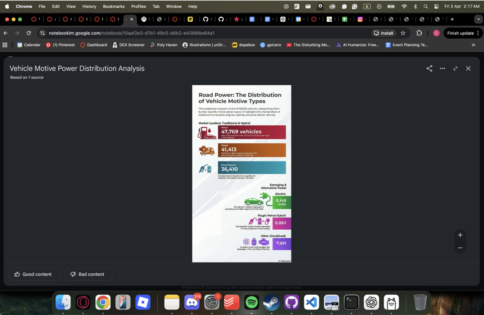

# Week 04

[← Back to Home](../index.md)

## Experiment 4: Artificial Intelligence

### Activity 1: Local AI with Ollama
I used Ollama to run a local AI model on my computer. The main difference was that everything ran locally, meaning no data was sent externally.

I tested it by describing a dataset from a previous experiment (phone-checking behaviour) and asking for visualisation ideas and p5.js code. The model was able to generate basic responses and functional code, but the outputs were more limited and less refined compared to ChatGPT.

In terms of performance, it felt fast for simple responses but struggled with more complex reasoning and depth. The biggest difference was the tradeoff between privacy and capability. While Ollama provided full control and data sovereignty, the quality and intelligence of responses were noticeably lower than cloud-based AI.

This activity showed that local AI is useful for simple tasks and privacy-sensitive work, but currently lacks the depth and flexibility of more advanced cloud models.

### Activity 2: Cloud AI with NotebookLM
I created a NotebookLM project combining my own work (weekly blogs, datasets) with external sources like Giorgia Lupi and Dear Data. 

I framed the notebook around data humanism and ethical design, which helped guide the AI’s responses. Compared to Ollama, NotebookLM was much better at identifying patterns across sources and generating more developed insights.

However, it sometimes made confident assumptions or simplified connections, which meant I had to stay critical of its outputs.

## Independent Study: AI-Assisted Data Exploration

### Dataset
I used a New Zealand vehicle motive power dataset because it relates to everyday life and broader issues like sustainability and transport.

### Understanding the data
AI helped quickly explain the dataset structure, identifying key categories like Petrol, Diesel, and Hybrid, and summarising overall distribution. 
This made it easier to understand the data, but the AI didn’t question category overlaps or missing context, showing its limitations.

### Designing representations
The AI initially produced standard outputs like bar charts and infographics. These were clear but generic.
I redirected it by specifying:
- different formats (time-based, experimental)
- audience
- intended meaning

This showed that AI defaults to safe, conventional designs unless guided.

### Critical evaluation
The AI defaulted to:
- bar charts
- simple colour schemes
- comparison-based visuals

I had to override this by asking for more intentional and exploratory representations.
The AI assumed that the dataset was clean and complete, the audience wanted simplified categories and the goal was clear comparison

The most interesting output was the more experimental representation, as it showed patterns and relationships rather than just numbers.

If I did this without AI, I would spend more time cleaning the data and making more deliberate design choices from the start.

## Reflection
This experiment showed that AI is useful for speeding up exploration and generating ideas, but it relies heavily on direction. The best results came from iterating and refining prompts rather than accepting the first output. It also highlighted the difference between local and cloud AI:
- local = more control, less capability
- cloud = more powerful, but less transparent

Overall, AI works best as a tool to support thinking, not replace it.

## Further Development
With more time, I would:
- refine and restructure the dataset
- explore more experimental visualisations
- compare AI outputs with fully manual design
- think more critically about how data is framed and who it represents

## AI Usage Statement

- I was absent from this class so I had ChatGPT analyze the slides and tell me step by step what I had to do exactly
- I used ChatGPT a lot to help me set up things like the Ollama and NoteBook
- Again, I used ChatGPT to organize my notes, expand on them and write a more readable journal entry.
